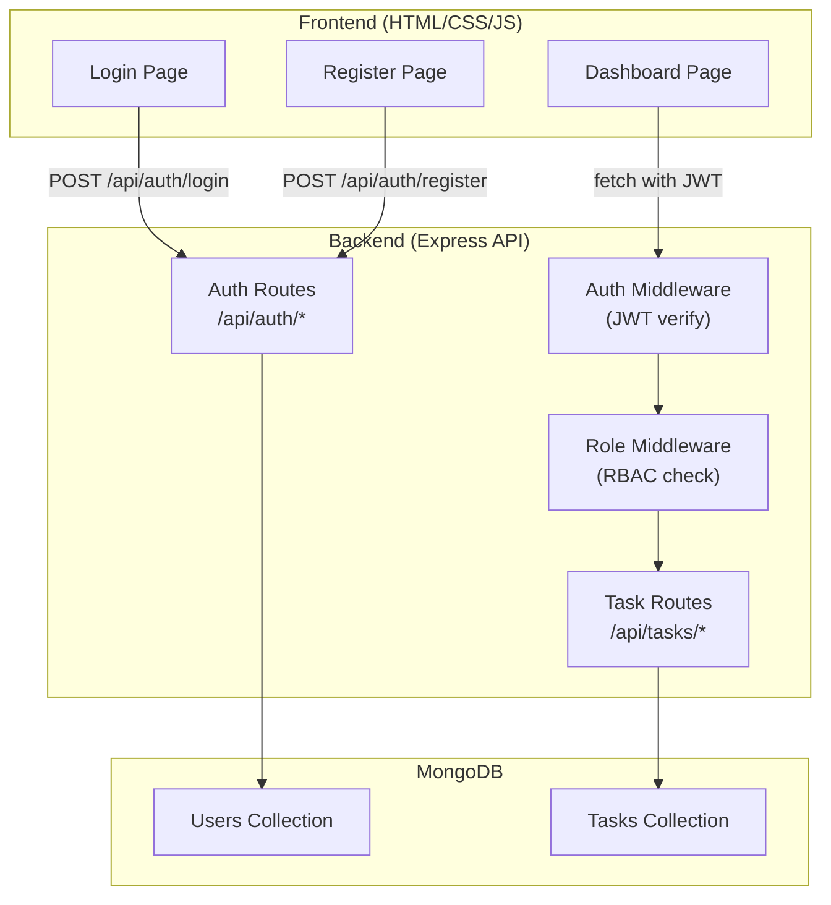

# Multi-Tenant Task Management System — Implementation Plan

## Overview

Build a task management web app where **multiple organizations (tenants)** share the same application but have fully **isolated data**. Users register under an organization, authenticate with JWT, and manage tasks scoped to their tenant. Role-Based Access Control (RBAC) ensures admins see all org tasks while regular users see only their own.

**Tech Stack:** Node.js · Express · MongoDB (Mongoose) · HTML/CSS/JS (Vanilla)

---

## High-Level Architecture & Workflow



### Request Flow (step-by-step)

1. **User registers** → Frontend sends `{ name, email, password, organization, role }` → Backend hashes password, saves user, returns JWT.
2. **User logs in** → Frontend sends `{ email, password }` → Backend verifies credentials, returns JWT.
3. **User accesses dashboard** → JWT is sent in `Authorization` header → `authMiddleware` decodes token and attaches `req.user` → `roleMiddleware` checks permissions → Controller queries tasks filtered by `organization` (and optionally by `createdBy`).
4. **CRUD operations** → All task endpoints enforce tenant isolation via the `organization` field stored on every task document.

---

## Folder Structure

```
Multi-Tenant Task Management System/
├── server/
│   ├── config/
│   │   └── db.js                  # MongoDB connection
│   ├── models/
│   │   ├── User.js                # User schema (name, email, password, organization, role)
│   │   └── Task.js                # Task schema (title, description, status, organization, createdBy)
│   ├── middleware/
│   │   └── auth.js                # JWT verification + role-check middleware
│   ├── routes/
│   │   ├── authRoutes.js          # POST /register, POST /login
│   │   └── taskRoutes.js          # GET, POST, DELETE /tasks
│   ├── controllers/
│   │   ├── authController.js      # Register & login logic
│   │   └── taskController.js      # CRUD logic with tenant filtering
│   ├── .env                       # PORT, MONGO_URI, JWT_SECRET
│   ├── package.json
│   └── server.js                  # Express app entry point
│
├── client/
│   ├── css/
│   │   └── style.css              # All styles
│   ├── js/
│   │   ├── auth.js                # Login & register logic
│   │   └── tasks.js               # Task CRUD logic
│   ├── login.html                 # Login + Register page
│   └── dashboard.html             # Task management dashboard
│
└── README.md                      # Setup instructions
```

> [!NOTE]
> The `client/` folder contains static files served by Express via `express.static`. No build step is needed.

---

## Data Models

### User Model (`server/models/User.js`)

| Field          | Type     | Details                              |
|----------------|----------|--------------------------------------|
| `name`         | String   | Required                             |
| `email`        | String   | Required, unique                     |
| `password`     | String   | Required, hashed with bcrypt         |
| `organization` | String   | Required — the tenant identifier     |
| `role`         | String   | `"admin"` or `"user"`, default `"user"` |
| `createdAt`    | Date     | Auto via `timestamps: true`          |

### Task Model (`server/models/Task.js`)

| Field          | Type       | Details                                    |
|----------------|------------|--------------------------------------------|
| `title`        | String     | Required                                   |
| `description`  | String     | Optional                                   |
| `status`       | String     | `"pending"` / `"completed"`, default `"pending"` |
| `organization` | String     | Required — ensures tenant isolation        |
| `createdBy`    | ObjectId   | Ref → User — who created the task          |
| `createdAt`    | Date       | Auto via `timestamps: true`                |

> [!IMPORTANT]
> **Tenant isolation** is enforced by always including `organization` in every database query. This is the simplest multi-tenancy pattern (shared database, shared collection, filtered by field).

---

## API Endpoints

### Auth Routes (`/api/auth`)

| Method | Endpoint    | Body                                                    | Response               |
|--------|-------------|---------------------------------------------------------|------------------------|
| POST   | `/register` | `{ name, email, password, organization, role? }`        | `{ token, user }`      |
| POST   | `/login`    | `{ email, password }`                                   | `{ token, user }`      |

### Task Routes (`/api/tasks`) — *All protected by JWT middleware*

| Method | Endpoint   | Description                                                        |
|--------|------------|--------------------------------------------------------------------|
| GET    | `/`        | Get tasks — admin sees all org tasks; user sees only own tasks     |
| POST   | `/`        | Create a task — auto-sets `organization` and `createdBy` from JWT |
| DELETE | `/:id`     | Delete a task — only if it belongs to user's organization          |

---

## Middleware Logic

### `authMiddleware` (JWT Verification)
1. Extract token from `Authorization: Bearer <token>` header.
2. Verify with `jwt.verify(token, JWT_SECRET)`.
3. Fetch user from DB, attach to `req.user`.
4. Call `next()` or return `401 Unauthorized`.

### RBAC Logic (inside Task Controller)
- **GET /tasks:**
  - If `req.user.role === 'admin'` → query: `{ organization: req.user.organization }`
  - If `req.user.role === 'user'` → query: `{ organization: req.user.organization, createdBy: req.user._id }`
- **DELETE /tasks/:id:**
  - Find task, verify `task.organization === req.user.organization` before deleting.

---

## Frontend Pages

### 1. Login / Register Page (`login.html`)
- **Two-tab interface** — toggle between Login and Register forms.
- **Register form fields:** Name, Email, Password, Organization Name, Role (dropdown: admin/user).
- **Login form fields:** Email, Password.
- On success → store JWT in `localStorage` → redirect to `dashboard.html`.

### 2. Dashboard Page (`dashboard.html`)
- **Header:** Shows logged-in user name, organization, role, and a Logout button.
- **Create Task form:** Title, Description fields + Submit button.
- **Task List:** Cards showing each task with title, description, status, and a Delete button.
- All API calls use `fetch()` with the JWT in the `Authorization` header.

### Design Approach
- **Dark theme** with gradient accents for a modern, premium feel.
- Smooth card hover animations and transitions.
- Google Font (Inter) for clean typography.
- Responsive layout using CSS Grid/Flexbox.
- Status badges with color coding (pending = amber, completed = green).

---

## Security Implementation

| Concern              | Solution                                               |
|----------------------|--------------------------------------------------------|
| Password storage     | `bcrypt.hash()` with salt rounds = 10                  |
| Authentication       | JWT tokens with 24h expiry                             |
| Tenant isolation     | `organization` field on every query                    |
| Route protection     | `authMiddleware` on all `/api/tasks` routes            |
| Input validation     | Basic checks in controllers (required fields)          |

---

## Proposed Changes

### Backend (`server/`)

#### [NEW] [server.js](file:///d:/INTERN's/NIT%20oru%20try/Multi-Tenant%20Task%20Management%20System/server/server.js)
Express app setup — connects to MongoDB, mounts routes, serves static frontend files from `../client`.

#### [NEW] [.env](file:///d:/INTERN's/NIT%20oru%20try/Multi-Tenant%20Task%20Management%20System/server/.env)
Environment variables: `PORT=5000`, `MONGO_URI`, `JWT_SECRET`.

#### [NEW] [config/db.js](file:///d:/INTERN's/NIT%20oru%20try/Multi-Tenant%20Task%20Management%20System/server/config/db.js)
Mongoose connection function with error handling.

#### [NEW] [models/User.js](file:///d:/INTERN's/NIT%20oru%20try/Multi-Tenant%20Task%20Management%20System/server/models/User.js)
User schema with bcrypt pre-save hook for password hashing.

#### [NEW] [models/Task.js](file:///d:/INTERN's/NIT%20oru%20try/Multi-Tenant%20Task%20Management%20System/server/models/Task.js)
Task schema with organization field for tenant filtering.

#### [NEW] [middleware/auth.js](file:///d:/INTERN's/NIT%20oru%20try/Multi-Tenant%20Task%20Management%20System/server/middleware/auth.js)
JWT verification middleware — extracts token, validates, attaches user to request.

#### [NEW] [controllers/authController.js](file:///d:/INTERN's/NIT%20oru%20try/Multi-Tenant%20Task%20Management%20System/server/controllers/authController.js)
`register()` — validates input, checks for existing user, hashes password, creates user, returns JWT.
`login()` — validates credentials, compares password with bcrypt, returns JWT.

#### [NEW] [controllers/taskController.js](file:///d:/INTERN's/NIT%20oru%20try/Multi-Tenant%20Task%20Management%20System/server/controllers/taskController.js)
`getTasks()` — RBAC-filtered query (admin sees org tasks, user sees own tasks).
`createTask()` — creates task with auto-populated organization and createdBy.
`deleteTask()` — verifies org ownership before deletion.

#### [NEW] [routes/authRoutes.js](file:///d:/INTERN's/NIT%20oru%20try/Multi-Tenant%20Task%20Management%20System/server/routes/authRoutes.js)
Maps `/register` and `/login` to auth controller functions.

#### [NEW] [routes/taskRoutes.js](file:///d:/INTERN's/NIT%20oru%20try/Multi-Tenant%20Task%20Management%20System/server/routes/taskRoutes.js)
Maps task CRUD endpoints, protected by auth middleware.

---

### Frontend (`client/`)

#### [NEW] [login.html](file:///d:/INTERN's/NIT%20oru%20try/Multi-Tenant%20Task%20Management%20System/client/login.html)
Login and registration page with tab-switching UI.

#### [NEW] [dashboard.html](file:///d:/INTERN's/NIT%20oru%20try/Multi-Tenant%20Task%20Management%20System/client/dashboard.html)
Task management dashboard with create form, task list, and user info header.

#### [NEW] [css/style.css](file:///d:/INTERN's/NIT%20oru%20try/Multi-Tenant%20Task%20Management%20System/client/css/style.css)
Complete styling — dark theme, gradients, animations, responsive layout.

#### [NEW] [js/auth.js](file:///d:/INTERN's/NIT%20oru%20try/Multi-Tenant%20Task%20Management%20System/client/js/auth.js)
Handles login/register form submissions, stores JWT, redirects to dashboard.

#### [NEW] [js/tasks.js](file:///d:/INTERN's/NIT%20oru%20try/Multi-Tenant%20Task%20Management%20System/client/js/tasks.js)
Fetches tasks, renders task cards, handles create and delete operations.

---

### Project Root

#### [NEW] [README.md](file:///d:/INTERN's/NIT%20oru%20try/Multi-Tenant%20Task%20Management%20System/README.md)
Setup instructions, prerequisites, and project overview.

---

## Verification Plan

### Automated Tests
1. Start the server with `npm start` inside `server/` and confirm MongoDB connection.
2. Open `http://localhost:5000` in the browser to verify frontend loads.

### Manual Verification (via Browser)
1. **Register** two users in different organizations (e.g., "Org-A" and "Org-B").
2. **Register** an admin and a regular user in the same organization.
3. **Login** as regular user → create tasks → verify only own tasks are visible.
4. **Login** as admin → verify all organization tasks are visible.
5. **Login** as user from a different org → verify no cross-tenant data leakage.
6. **Delete** a task and verify it is removed.

---

## Demo Presentation Script

> *Use this script while presenting the project in a demo video (approximately 3–4 minutes):*

**[Opening — 15 sec]**
"Hi, today I'm going to walk you through a Multi-Tenant Task Management System. This is a full-stack web application built with Node.js, Express, and MongoDB on the backend, and vanilla HTML, CSS, and JavaScript on the frontend."

**[Architecture — 30 sec]**
"The key concept here is multi-tenancy. Multiple organizations share the same application, but their data is completely isolated. We achieve this by storing an 'organization' field on every user and task document, and filtering all database queries by this field. This is called the 'shared database, shared collection' multi-tenancy pattern."

**[Registration Demo — 30 sec]**
"Let me register two users. First, Alice from 'TechCorp' as an admin. Then Bob from 'TechCorp' as a regular user. And finally, Charlie from 'DesignHub' as an admin."

**[RBAC Demo — 45 sec]**
"Now I'll log in as Bob — a regular user at TechCorp. I'll create a couple of tasks. Notice Bob can only see his own tasks. Now let me switch to Alice — an admin at TechCorp. Alice can see ALL tasks within TechCorp, including Bob's. This is our Role-Based Access Control in action."

**[Tenant Isolation Demo — 30 sec]**
"Now let me log in as Charlie from DesignHub. Even though Charlie is an admin, he sees zero tasks — because TechCorp's tasks are completely invisible to DesignHub. This proves our tenant isolation is working correctly."

**[Code Walkthrough — 45 sec]**
"Let me quickly show the key parts. In the auth middleware, we verify the JWT token and attach the user to the request. In the task controller, we build the query based on the user's role — admins get all org tasks, regular users get only their own. The 'organization' field is the backbone of our multi-tenancy."

**[Closing — 15 sec]**
"This project demonstrates multi-tenancy, JWT authentication, RBAC, and full CRUD operations — all in a clean, minimal implementation. Thank you for watching."

---

## Open Questions

> [!IMPORTANT]
> **MongoDB Connection:** Do you have a MongoDB Atlas URI ready, or should I set it up to use a local MongoDB instance? I'll default to a placeholder URI that you can replace in the `.env` file.

> [!NOTE]
> **Role selection during registration:** The current plan allows users to self-select their role (admin/user) during registration for demo simplicity. In a production system, only existing admins should be able to assign admin roles. Is this acceptable for your demo?
